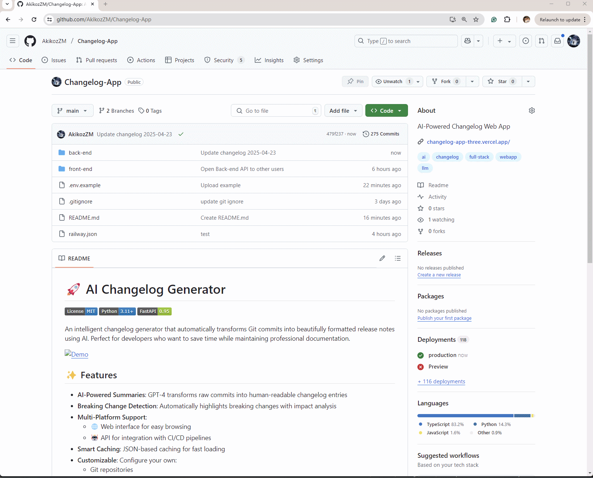
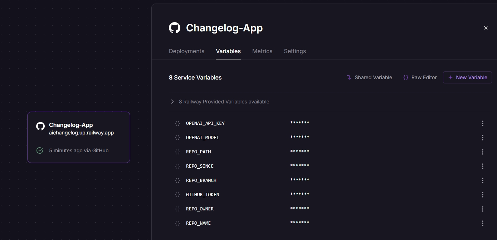

# 🚀 AI Changelog Generator

An intelligent changelog generator that automatically transforms Git commits into beautifully formatted release notes using AI. Perfect for developers who want to save time while maintaining professional documentation.

|Fast Demo|
|:-:|
||

## ✨ Features

- **AI-Powered Summaries**: GPT-4 transforms raw commits into human-readable changelog entries
- **Breaking Change Detection**: Automatically highlights breaking changes with impact analysis
- **Multi-Platform Support**: 
  - 🌐 Web interface for easy browsing
  - 🤖 API for integration with CI/CD pipelines
- **Smart Caching**: JSON-based caching for fast loading
- **Customizable**: Configure your own:
  - Git repositories
  - OpenAI models
  - Output formats

## 🛠️ Tech Stack

| Component       | Technology |
|-----------------|------------|
| Backend         | FastAPI, Python 3.11 |
| Frontend        | React, TypeScript, TailwindCSS |
| AI Engine       | OpenAI "gpt-4.1-nano" |
| Deployment      | Railway (Backend), Vercel (Frontend) |
| Version Control | GitHub |

## 🎨Design Concept

|Concept|
|:-:|
||

## 🚀 Quick Start

### Test Environment
- Python 3.11.3
- OpenAI API key
- Git repository

### Step by step
- Clone my repository
- cd Changelog-App/back-end
- pip install -r requirements.txt
- cp .env.example .env
- Deploy the back-end folder on Railway
- Set up the variables

|Back-end setup|
|:-:|
||

- Use "http POST https://YOUR_HTTP_DOMAIN/git_generate"
- (If you want to use my domain, feel free to reach out!)
- The changelog will be auto-generated in your GitHub Repo -> back-end/outputs/changelog.json

